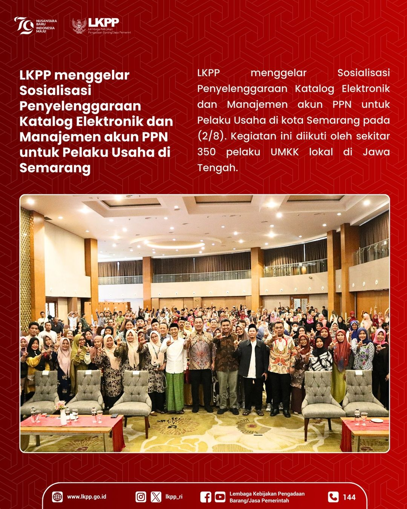

<h2>Howdy there, partner!</h2>

My name is Hasimy Md, a Junior Back-End Developer at <a href="https://telkom.co.id/" target="_blank">Telkom Indonesia</a>, and stationed in the tribe <a href="https://www.eproc-gov.tech" target="_blank">GovTech Procurement</a>.

<h3>As of now I code with:</h3>

  
  
  
  
  
  
   
  
  
  
  <a href="https://www.heroku.com">
  
  
  
  

<h3>#LKPPDigitalTransformation</h3>

  

Above are some pictures posted by LKPP on <a href="https://www.instagram.com/lkpp_ri/" target="_blank">@lkpp_ri!</a> GovTech Procurement's service for procurement of goods digital transformation with LKPP based on the Presidential Decree No. 17 of 2023.</a>  Currently, the weather is at <b> 30°C, and it's <i>partly cloudy</i></b>. Today, the sun will rise at <b>05:03</b> and sets at <b>17:27</b>, Western Indonesian Time.

<h3>Social Medias:</h3>

 

------------

This README file will be updated to keep up with <a href="https://www.instagram.com/lkpp_ri/" target="_blank">@lkpp_ri</a>'s posts! Last updated at: Tuesday, October 16th 2024, 08:55 GMT+7 

