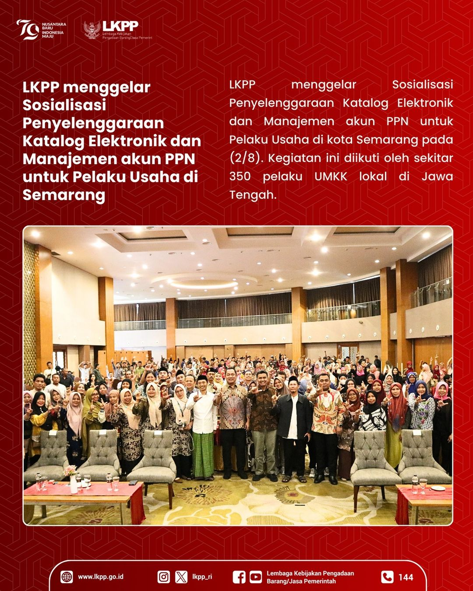
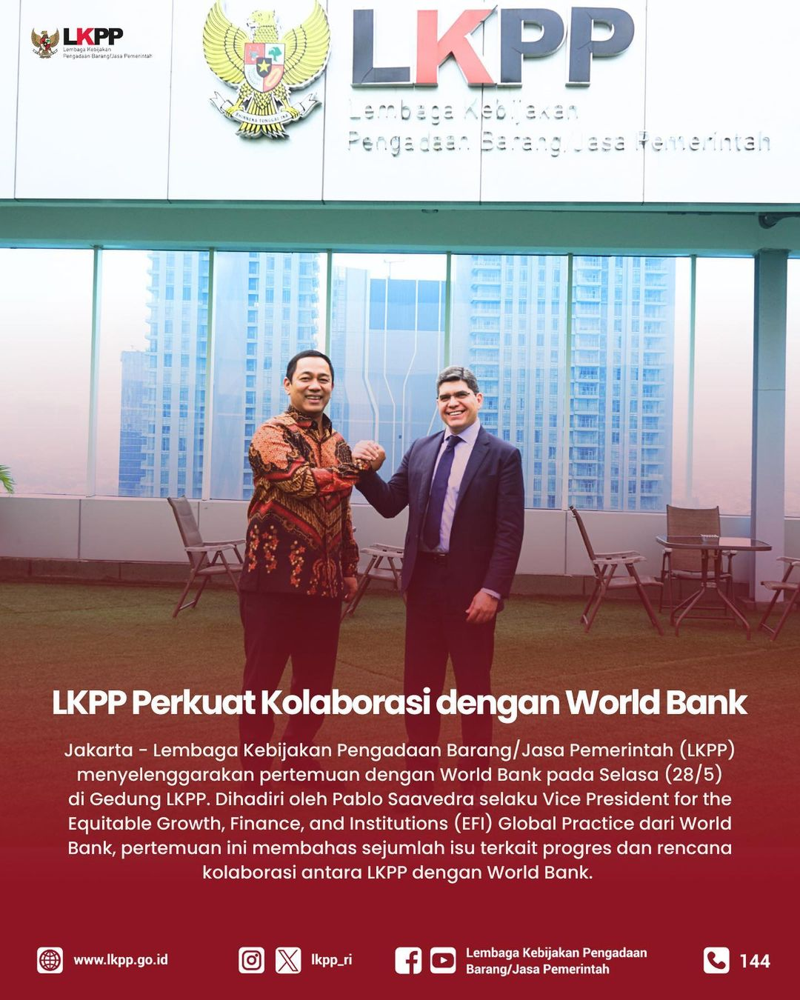

  

  <h3>Back-End Engineer @ <a href="https://telkom.co.id/">Telkom Indonesia</a></h3>
  
Currently stationed in the Tribe of <b>E-Government Procurement</b>.

  

    
    
  

---

### 👨‍💻 About Me

Hello! I'm a Back-End Engineer based in Indonesia, currently focused on the e-procurement digital transformation at **LKPP** (Lembaga Kebijakan Pengadaan Barang/Jasa Pemerintah). I specialize in building reliable, high-performance backend services using **Golang** and **Node.js (Vanilla JS & TypeScript)**.

Lately, I've also been expanding my skillset into the frontend! I've revisited **React.js** and also currently exploring **Next.js**, rediscovering on integrating backend APIs with Server-Side Rendered (SSR) web applications.

* **Currently exploring:** React.js, Next.js and advanced DevOps.
* **Fun fact:** I maintain my own personal server sandbox to host my side projects and streamline my DevOps workflows.

---

### 🛠️ Tech Stack & Tools

**Languages & Frameworks:** 

**Databases & Caching:** 

**DevOps & Infrastructure:** 

---

### 🏛️ #LKPPDigitalTransformation

GovTech Procurement's service for procurement of goods digital transformation with LKPP based on Presidential Decree No. 17 of 2023.

   
   
  

<i>Updates from <a href="https://www.instagram.com/lkpp_ri/">@lkpp_ri</a></i>

---

### 🌤️ Jakarta Weather & Time

> Currently, the weather in Jakarta is **30°C** with **few clouds**.
> The sun rises at **06:02** and sets at **17:48** (WIB).

   
  
<small><i>This README is dynamically updated. Last refresh: Monday 29 June at 09:50 GMT+7</i></small>

